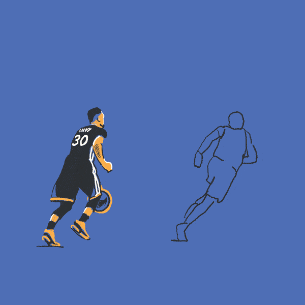

<h1 align="center"><b>Hi , I'm Tiago Nocella</b></h1>

  

## <picture></picture> About me

<table>
<tr>
<td width="65%" valign="middle">

- 👨‍💻 I’m a **Front-End Developer** focused on building modern and useful web interfaces.
- 🏫 I’m currently studying **Computer Engineering** at Universidad de la República.
- 💻 I work with `React`, `JavaScript`, `Tailwind CSS`, `Firebase` and modern web tools.
- 🚀 I’m building real projects such as business websites, web apps and e-commerce simulations.
- 💼 I’m developing **N&M DEV.uy**, a web development project focused on helping small businesses improve their online presence.
- 🧑‍🎓 I’m currently learning `Backend`, `Databases` and better software architecture.
- 🤓 Always learning, improving and building new things.
- 🏀 Outside of coding, I’m a basketball and sports enthusiast.

</td>
<td width="35%" align="center" valign="middle">

</td>
</tr>
</table>

<h3 align="left">Connect with me:</h3>

<h3 align="left">Languages and Tools:</h3>

        

